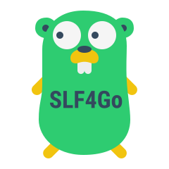

# slf4go


Simple Logging Facade for Golang

This library file allows you to choose to use `zap` or `logrus` log implementation through configuration file.


Class library default load `slf4go.yml` config file.
```yaml
log:
    provider: zap
    zap:
      level: info
      disableCaller: false
      encoding: console
      encoderConfig:
         levelEncoder: capitalColor

```
So you can output logs using `zap`  
If you want to use `logrus`, you can configure it like this
```yaml
log:
    provider: logrus
```

Here is an example of the output log
```golang
package test

import (
	"testing"
	"time"

	"github.com/less4go/slf4go"
	"github.com/less4go/slf4go/types"
)

type MyTest struct {
	aaa string
	bbb int
	ccc bool
}

func TestLogger(t *testing.T) {

	slf4go.Logger.Debug("aaa",
		types.NewField("string", "string"),
		types.NewField("int", 100),
	)
	slf4go.Logger.Info("a fields",
		types.NewField("string", "string"),
		types.NewField("int", 100),
		types.NewField("time", time.Now()),
	)
	slf4go.Logger.Info("aaa")

	slf4go.Logger.With(
		types.NewField("a", "b"),
		types.NewField("int", 100),
		types.NewField("time", time.Now()),
	).Info("12345")
	slf4go.Logger.Info("bbb")

	slf4go.Logger.Warn("Warn log")
}
```


